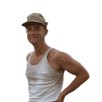

# Hola, I'm Max Robles

I'm a junior front-end developer with a full stack bootcamp. While I'm still building my confidence in my skills, I've got a good grasp of JavaScript, TypeScript, CSS, and HTML. I'm excited to dive into different areas of software development and I'm always up for trying out new projects!

## 🛠 Skills and Technologies
- **Languages:** JavaScript, TypeScript, CSS, HTML
- **Frameworks and Libraries:** React, React Native, Bootstrap, Tailwind, Node.js, Next.js
- **Tools and Platforms:** GitHub, VSCode, Figma

## 🚀 Projects
### Chess Timekeeper
This Chess Clock App is a mobile application developed using Expo and React Native. It's designed for chess players to keep track of their time during games. The app features individual timers for each player, customizable time settings, and increment options. The sleek and user-friendly interface makes it suitable for both casual and competitive play.

- **Check it out [here](https://apps.apple.com/fr/app/chess-timekeeper/id6473749061?l=en-GB)**

### Argentometro
An engaging and interactive quiz game designed for iPhone, built with React Native. This app offers a variety of questions across multiple categories of Argentinian culture, challenging players with timed questions, levels, and rewards.

- **Check it out [here](https://apps.apple.com/fr/app/argentometro/id6475984871?l=en-GB)**

## 🎓 Education
- **Bootcamp:** SoyHenry boot camp, started end of March and finishing end of August.
-  Studied coding independently for about five months.

## 🌐 Languages
- **Spanish:** Native
- **English:** Full professional proficiency
- **French:** Professional working proficiency

## 📫 Contact
-**Paris, France**
- **Email:** maxirobles1234@gmail.com
- **LinkedIn:** [Maximiliano Robles](https://www.linkedin.com/in/maximiliano-robles-39436113b/)

## 🌱 Other Interests
In addition to coding, I am a professional chef with over 15 years of experience. For the past 5 years, I have worked in Paris, managing kitchen organizations with teams of up to 10 people.
